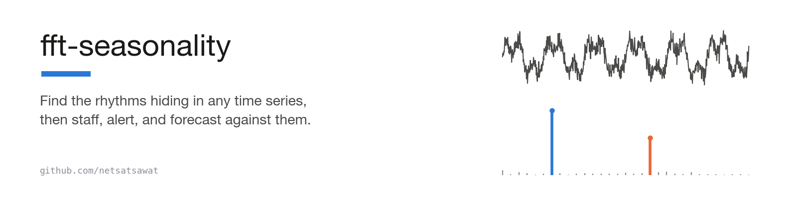
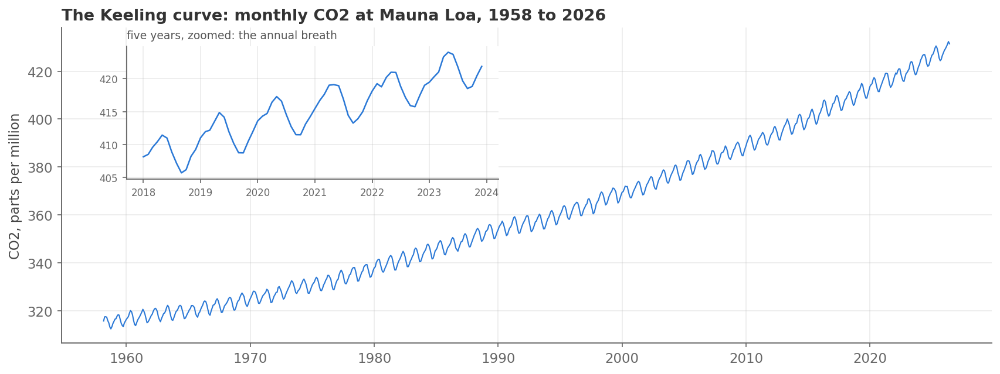
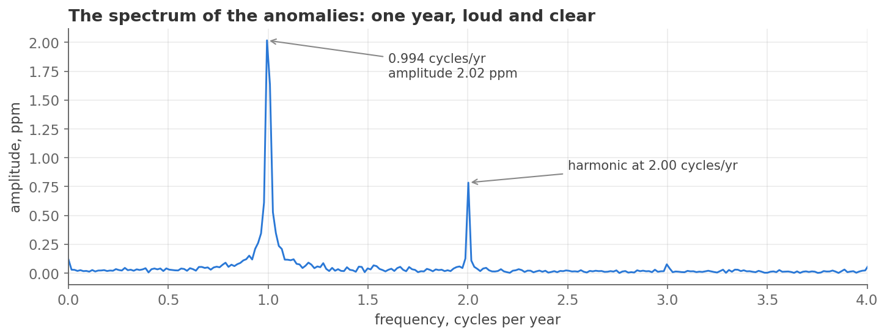
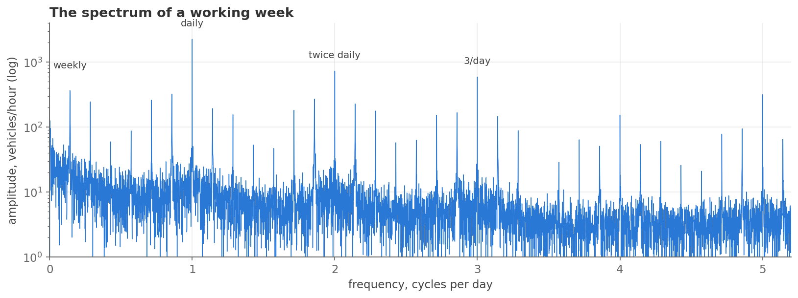
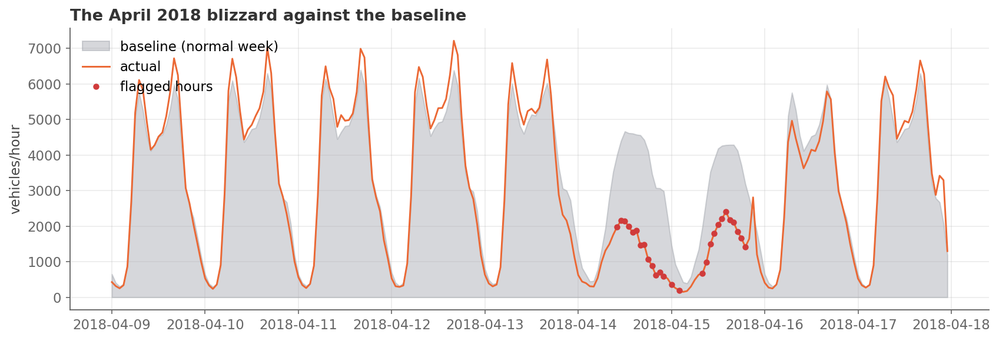

<h1 align="center">
  <picture>
    <source media="(prefers-color-scheme: dark)" srcset="pic/banner-dark.png">
    
  </picture>
</h1>

<p align="center">
  <a href="#-the-notebooks">Notebooks</a>&nbsp;&nbsp;·&nbsp;&nbsp;<a href="#-where-this-applies-in-the-real-world">Real-world uses</a>&nbsp;&nbsp;·&nbsp;&nbsp;<a href="#-running-it-yourself">Run it</a>&nbsp;&nbsp;·&nbsp;&nbsp;<a href="https://satsawat.ai/#newsletter">Newsletter</a>
</p>

<p align="center">
  <a href="LICENSE"></a>
  <a href="https://www.python.org/"></a>
  <a href="notebooks/"></a>
  
  
  <a href="https://satsawat.ai"></a>
</p>

Three Jupyter notebooks teach you to find the repeating cycles in a
stream of measurements, then put them to work in three ways: a table
of what a normal hour looks like, an alarm for abnormal hours, and a
table showing how big you would have to build capacity (a road, a
team, a server) to avoid being overloaded. The examples are real:
sixty-eight years of atmospheric CO2, and thirty-three months of real
hourly traffic on an interstate highway. This tutorial assumes basic Python and
nothing else. You need no prior meeting with the Fourier transform. The
Fourier transform is the calculation that takes a messy series and
returns the list of repeating cycles hidden inside it.

Every operational series has rhythms in it: sales swell before payday,
servers run hot every evening, call queues explode on Monday mornings.
Everyone in the meeting sort of knows these patterns. Nobody can say
exactly how big they are or which ones matter. The FFT, the fast way
computers run a calculation called the Fourier transform, is a
sixty-year-old algorithm that answers both questions. Hand the FFT
your messy series. It hands back the list of cycles hiding inside,
each with a size attached, in your own units. That turns "Mondays feel
busy" into a measured cycle you can staff against or subtract away to
see what is really changing underneath.

## What you need to know first

Six words carry the whole tutorial. Notebook 01 has a longer table in
the same spirit near its end.

| Word | Plain meaning |
|------|---------------|
| time series | a list of measurements taken one after another in time, such as one CO2 reading per month or one vehicle count per hour |
| cycle (also called seasonality) | a pattern that repeats at a fixed interval: every day, every week, every year |
| Fourier transform, FFT | a calculation that takes a series and returns the list of cycles inside it, each with a size. The FFT is the fast way computers do that calculation |
| spectrum | the FFT's answer drawn as a chart: how fast a cycle repeats along the bottom, how big it is up the side. A tall spike means a strong cycle at that speed. The notebooks call the speed a frequency. Speed and frequency mean the same thing in this file |
| amplitude | how big a cycle is, in the data's own units (parts per million of CO2, vehicles per hour) |
| baseline | a table of what a normal hour looks like, built from history. Notebook 03 uses one baseline to forecast, to raise alarms, and to size capacity |

## 🚀 Running it yourself

```
git clone https://github.com/netsatsawat/fft-seasonality.git
cd fft-seasonality
python -m venv .venv && source .venv/bin/activate
pip install -r requirements.txt
jupyter notebook notebooks/
```

The last command opens a browser tab listing the three notebooks.
Open `01_fourier_from_scratch.ipynb` first and run the cells in
order. The first printed output comes from a small function I call a
probe. The probe checks whether a series contains a wave at one chosen
speed. I built a made-up series with two waves in it, and the probe
finds both and correctly finds nothing at a third speed. The speeds
are in Hz, which means cycles per second:

```
probe at  2 Hz: 1.0000
probe at 20 Hz: 0.5000
probe at 11 Hz: 0.0000
```

The made-up series holds a wave of size 1.0 at 2 Hz and a wave of size
0.5 at 20 Hz, and nothing at 11 Hz, so those three lines are the right
answer. If you see them, the setup works.

Everything runs offline. The two datasets ship in `data/`:

- [`co2_mm_mlo.csv`](data/co2_mm_mlo.csv): monthly mean CO2 at
  Mauna Loa, 1958 to 2026, from NOAA's Global Monitoring Laboratory.
  820 monthly values, in parts per million (ppm). This record is
  known as the Keeling curve, after Charles David Keeling, who started
  it in 1958.
- [`metro_traffic.csv`](data/metro_traffic.csv): hourly vehicle
  counts on I-94 (UCI Machine Learning Repository), January 2016 to
  September 2018, cleaned onto a strict hourly grid. 24,096 hours,
  one row for every hour, with no missing values.

Notebooks 02 and 03 save their figures into `pic/`, so running them
overwrites four PNG files there. Jupyter also saves each notebook
file with your fresh outputs. Neither harms the notebooks. One
caution: the checking script described below insists that every cell
in a notebook ran once, top to bottom, in order. If you plan to run
that script after playing with the notebooks, use Restart and Run All
before you do.

You never need to run [`data/build_dataset.py`](data/build_dataset.py).
The script fetches fresh copies of both files from NOAA and UCI over
the network. It prints the row counts before and after it removes
duplicate hours, and the 4.2% of hours it fills by drawing a straight
line between neighbours. Notebook 03 quotes that 4.2% too. Two more
cleaning steps are explained in the script's comments rather than
printed: it cuts away everything before 2016 because of a sensor
outage from mid-2014 to mid-2015, and it spreads the holiday flag
across each holiday's whole day, because the raw file stamps that
flag only on the midnight row. A refresh can move the numbers the
notebooks print, so treat it as optional.

## What the notebooks find

### Made-up signals, so the truth is known

The whole Fourier idea fits in four lines of numpy. Notebook 01
builds this function before it touches any library call. Here it is,
docstring left out:

```python
def probe(signal, t, freq):
    s = np.mean(signal * np.sin(2 * np.pi * freq * t))
    c = np.mean(signal * np.cos(2 * np.pi * freq * t))
    return 2 * np.hypot(s, c)
```

Multiply the series by a clean test wave at one speed, then average
the product. Near zero means no wave at that speed. Anything else
means the series contains one. Repeat for a sweep of speeds and the
result is the spectrum. Numpy's `rfft` computes the same sweep all at
once. Notebook 01 draws the probe sweep on top of the `rfft` line,
where they agree at every shared speed, and then asserts that the
`rfft` sizes at 2 Hz and 20 Hz match the 1.0 and 0.5 that were built
into the made-up series.

Sampling means taking a reading every so often: once a month, once an
hour. Sampling has a limit. Nothing warns you when you cross it. Your
samples can only show cycles slower than half the sampling rate.
A faster cycle shows up disguised as a slower one, which is called
aliasing. Notebook 01 shows it happen: a 20 Hz wave sampled at 15 per
second swears it is 5 Hz. So monthly data cannot show cycles shorter
than two months. Hourly data cannot show anything under two hours.

### Sixty-eight years of CO2



The CO2 record ranges from 312.4 to 432.3 ppm (its lowest and highest
monthly readings) and breathes once a year, peaking in May and
bottoming out in October. Feed the raw series to the FFT and the
long climb floods the chart. The FFT only reports sizes at a fixed
set of speeds, which I will call the grid. At the slowest speed on
that grid sits the tallest peak, 36.5 ppm, and it is the climb, not a
cycle. Beside it, the yearly cycle is a foothill. The fix is to
subtract a smooth version of the series first (the average of the
surrounding 12 months) and study what is left, which the notebook
calls the anomalies. Now the yearly peak stands out.



A repeating shape that is not a smooth wave shows up as a main cycle
plus extra lines at two and three times its speed, called harmonics.
So the smaller spike at two cycles per year is not a six-month season.
It is the yearly cycle showing its lopsided shape. A lopsided sawtooth
is a repeating shape that climbs and drops at different rates rather
than rising and falling smoothly, and the CO2 year is one. Its
harmonic, read off the spectrum at 0.79 ppm, is part of that lopsided
shape.

The notebook then calls four independent witnesses, and all four say
twelve months:

- the spectrum, the peak in the chart above
- plain averaging by calendar month, no transform at all
- the autocorrelation function, which slides the series against a
  delayed copy of itself and scores how well the two agree at each
  delay. The score runs from -1 (a perfect mirror image) to 1 (a
  perfect match). It reads 0.97 at a delay of 12 months, so the
  series almost repeats itself a year later, and -0.83 at 6 months,
  so half a year later it is close to upside down
- STL, a routine from the statsmodels library that splits a series
  into a trend, a season and a leftover

Their sizes look like they disagree. Three terms make sense of the
three numbers. A point on the FFT grid is called a bin, and the
nearest bin is the grid speed closest to once a year. The fundamental
is the main cycle itself, without its harmonics. The calendar swing is
the gap between the highest month's average and the lowest. With those
in hand, the notebook reconciles the nearest-bin FFT readout (2 ppm),
the true fundamental (2.8 ppm), and the calendar swing (6.3 ppm), and
all three are right answers to different questions. The 2 ppm is what
the nearest grid speed shows. The yearly wave's true size is 2.8 ppm.
That leaves 6.3 ppm, the calendar swing from the highest month down to
the lowest.

Each number comes from a different step. The yearly cycle falls
between two grid points, so the nearest bin reads nearly 30% low.
Fitting a wave at exactly one cycle per year, off the grid, gives
2.84 ppm, the true size. Averaging each calendar month gives May at
+3.11 ppm and October at -3.18 ppm, a swing of 6.29 ppm from top to
bottom. A pure wave of that size swings 5.68 ppm top to bottom
(2 x 2.84). The lopsided sawtooth adds about 0.6 ppm more, which
reaches the 6.3 ppm calendar swing. My rule is simple. When you need
the size itself, measure at the exact speed you care about. If you
cannot, fade both ends of the record down to zero first. Notebook 01
calls that fade a window, and it stops a cycle's size leaking into the
neighbouring grid speeds.

Is the peak real? Shuffle the anomalies 1000 times, take the tallest
peak of each shuffle, and compare. The tallest peak chance ever
produced was 0.57 ppm. The real one is 2.02 ppm. Zero shuffles beat
it, so the p-value (the share of shuffles that beat the real peak)
sits below 0.001.

A last experiment manufactures twenty years of monthly data with a
known 12-month cycle of size 1, adds random jitter (noise) of growing
size, and counts over 50 trials how often each method still finds 12
months. With noise up to twice the signal's size, the spectrum finds
it every time. At three times, it still finds it 78% of the time. The
autocorrelation function finds it only 82% of the time even at
half-size noise, because its misses pick a delay of 24 months, the
cycle's own double.

### Thirty-three months of traffic



*The spectrum of a working week.*

Along the bottom axis is how many times per day a cycle repeats. Up
the side is the size of that cycle in vehicles per hour, on a log
scale, so each gridline up is ten times bigger. The tallest spike, at 1
cycle per day, has an amplitude of 2,245 vehicles per hour. Day
versus night is the biggest fact about this road. The spikes at 2 and
3 per day are the harmonics again, the shape of a day with two rush
hours. A weekly rhythm sits at 0.14 cycles per day, which is one seventh. It
creates two smaller spikes one seventh away from the daily spikes:
0.857 (that is 1 minus 0.14) and 1.857 (that is 2 minus 0.14). These
are called sidebands. The daily cycle is strong on weekdays and weak
at weekends. A cycle whose strength rises and falls shows up as its
main line plus shifted copies on either side. As a check, notebook 03
builds a fake series with a daily wave that swells once a week. Its
spectrum shows the daily line with one sideband a seventh below at
0.857 per day and one a seventh above at 1.143, so the sideband
reading holds.

Planning needs a number per future hour, the baseline. Notebook 03
builds two and races them. The first is a 168-slot hour-of-week
lookup table (the notebook calls it the climatology): one average per
hour of the week (Monday midnight is slot 0, Sunday 11pm is slot
167), learned from 2016 and 2017, about 104 observations per slot.
The second is harmonic regression: add up smooth waves at the daily
and weekly speeds and at a few of their harmonics, and let the
computer choose the size of each wave that fits history best. Each
harmonic adds a sine and a cosine at the daily speed and a sine and
cosine at the weekly speed, which is four numbers. Add one shared
constant for the whole model, so 3, 6 or 10 harmonics need 13, 25 or
41 numbers in total.
Both are scored on the first nine months of 2018. Neither saw those
months. Each is scored by its average miss per hour, called the mean
absolute error. The lookup table wins, 267 versus roughly 500
vehicles per hour of error. 267 is about 8% of the mean demand of
3,313 vehicles per hour (the capacity table below shows 3312 for the
same mean, because it rounds down). That same table explains 94% of
the ups and downs in 2018 (R squared 0.944) against 88% for the best
harmonic fit. The lesson I want you to take: the spectrum tells you
which structure exists, and a plain backtest (train on old data,
score on newer data the model never saw) picks the model.

The same baseline works as an alarm. For each 2018 hour the notebook
measures how far demand sits from its slot's normal, counted in
standard deviations (the typical size of that slot's wobble in the
training years), and flags anything beyond 3. The notebook calls that
count a z-score per slot. Out of 6,552 test hours, 127 crossed the
line: 1.9% of hours flagged. The worst days are New Year's Day, July
4, Memorial Day, two January days, and a sub-freezing April weekend
that cut demand by 60%. Saturday 14 April 2018 alone ran 60% below a
normal Saturday. Sunday was flagged too, less deeply. The alarm
knew nothing about weather or holidays. For the holidays, the fix is
a holiday column in the baseline, so the alarm stops spending itself
on dates you already know.



The same baseline settles the capacity argument. The busiest slot,
Wednesday at 4pm, averages 6,395 vehicles per hour, 1.93 times the
overall mean. Notebook 03 then asks what each candidate capacity
would have cost in the nine test months. Two of the rows use
percentiles of the baseline: the 80th percentile is the level that
80% of the 168 slot averages sit below, and the 95th is the level
that 95% sit below. Share of demand unserved means, of all the
vehicles that wanted to pass in those nine months, the share that
arrived above the capacity line.

| capacity sized to | veh/h | hours over capacity in 2018 | share of demand unserved |
|---|---|---|---|
| mean demand | 3312 | 3441 | 26.13% |
| 80th percentile of baseline | 5104 | 1391 | 4.63% |
| 95th percentile of baseline | 5971 | 485 | 0.94% |
| baseline max | 6395 | 224 | 0.25% |

Sizing to the mean fails on a timetable, ten times a week (two rush
hours, five weekdays). Sizing to the 95th percentile cuts unserved
demand below one percent.
Where the line belongs is a business judgement. The table makes it a
judgement about two numbers instead of adjectives.

## How the numbers are checked

The purple badge means two things. Inside the notebooks, every number
that matters is computed twice by methods that share no code: the
hand-made probe against `rfft`, the spectrum against month averaging,
the autocorrelation function and STL, the real traffic spectrum
against a manufactured one. Outside them,
[`scripts/verify_readme_claims.py`](scripts/verify_readme_claims.py)
recomputes the headline numbers in this README from the CSVs in
`data/` and from the notebook sources, then checks that the exact
wording appears here. The headline numbers are the date spans and
record lengths, the four-line probe, the 5 Hz alias, the three CO2
sizes (2, 2.8 and 6.3 ppm), the 168 slots, the 267 versus 500
backtest, the 1.9% flag rate and the 60% April weekend. The other
numbers in this file are copied
from the notebook outputs, which are committed alongside the code
that printed them, and the script does not recompute those. It also
checks that each notebook was executed top to bottom with no errors,
that the traffic file is a gap-free hourly grid, and that every local
file link resolves. GitHub runs the script automatically on every
change (a continuous integration check), under Python 3.9 and 3.12.
Run it yourself:

```
python scripts/verify_readme_claims.py
```

The last line should read `every quoted README number matches its
artifact`. Read that line as covering the headline numbers listed
above. If one of those drifts from the data, the run fails.

## 📚 The notebooks

### [01 · Fourier from scratch](notebooks/01_fourier_from_scratch.ipynb)

What the transform does, built as a hand-made probe scan before any
library call, then checked against `rfft` on a made-up series with
known sizes. Amplitude, frequency and phase (where in its cycle a
wave sits at time zero). Then the three practical traps, each
demonstrated rather than described. Aliasing is the first. Spectral
leakage is the second: a cycle that does not fit a whole number of
times in the record smears across neighbouring grid points, and the
Hann window (a fade at both ends of the record, shaped like a raised
cosine) tames it. The third is noise, and why noise mostly cannot
hide a real cycle. The notebook has a plain-words vocabulary table
near its end.

### [02 · Seasonality in the Keeling curve](notebooks/02_seasonality_in_the_keeling_curve.ipynb)

Real data, and the raw FFT stumbles at once: the CO2 trend floods the
spectrum with leakage, the most common practical mistake in this
field. The 2020 version of this tutorial quietly dropped the two
slowest grid speeds from the chart, which hides the symptom and
leaves the leakage. Remove the trend properly and the annual cycle
stands clear. The notebook then gets four independent witnesses to
agree, reconciles the three amplitudes, runs a permutation test (the
1000 shuffles above) that turns the peak into a defensible claim, and
runs a synthetic stress test that maps where each method starts
lying. STL adds a detail the fixed averaging missed: the yearly swing
grew from 6.2 ppm in the first two decades to 7.1 ppm in the last
two. One repair of my own vocabulary is in there as well. What I used
to call a periodogram is an amplitude spectrum: a periodogram plots
squared sizes, and this tutorial plots sizes in the data's own units.

### [03 · Demand rhythms and staffing](notebooks/03_demand_rhythms_and_staffing.ipynb)

Hourly Interstate 94 traffic, and the business end of the series.
The spectrum names the rhythms (daily, weekly, harmonics that are
rush hours in disguise, sidebands that encode weekends). Then the
lookup table beats harmonic regression on 2018 data that neither
model saw, and the notebook explains why that is the right lesson
rather than an embarrassment. The baseline becomes an alarm and a
capacity table, and a closing section on honest limits says what the
method cannot do.

## 💼 Where this applies in the real world

The traffic sensor is a stand-in. Diagnose the rhythms, build a
baseline, act on deviations: those three steps are the daily bread of
several jobs, and notebook 03 is written so you can replace the CSV
and keep the code.

- Contact centers, field service, emergency departments and
  warehouses all staff against an hour-of-week demand profile, and
  the capacity table in notebook 03 is that conversation with numbers
  attached.
- The per-slot alarm knows a quiet Monday 8am is an incident and a
  quiet Sunday 3am is just Sunday. Notebook 03 shows it finding real
  holidays and real snowstorms with a 1.9% flag rate. The same
  pattern watches network load, API request rates, payment volumes
  and IoT sensor feeds.
- The detected periods become extra input columns (day-of-week flags,
  and sine and cosine waves at the found speeds) that forecasting
  models use, and the backtest in notebook 03 is the honest way to
  decide whether a fancier model earns its complexity.
- Aliasing, leakage and the need for evenly spaced readings are the
  traps waiting inside any machine-logged series that has been
  thinned out or has holes in it. Notebook 01 demonstrates each one
  on data where the truth is known, the cheapest place to learn them.
- Any series where a trend and a season share the data follows the
  notebook 02 workflow: remove the trend, transform, cross-check,
  test against shuffles. Energy use, retail sales, and long
  temperature records are three such series.

## Limits

Notebook 03 closes with a section it calls honest limits, and
notebook 02 adds two of its own.

- 4.2% of the traffic hours were filled in by drawing a straight line
  between neighbours. On a gappier record, filling gaps starts
  inventing rhythm, and a method built for gaps (Lomb-Scargle) is the
  right tool.
- Holidays are not periodic. No frequency method will ever predict
  July 4. A holiday is calendar knowledge and belongs in the baseline
  as a column of its own, which is why the alarm still flags holidays
  today.
- One sensor, one direction, three years. Demand patterns drift, so a
  production baseline gets re-estimated on a schedule.
- Weather sits outside the model, so the alarm detects storms but
  cannot predict their impact. That needs weather forecasts as inputs,
  which is a different problem.
- The autocorrelation function confuses a period with its multiples.
  In the stress test its misses picked a delay of 24 months for a
  12-month cycle. The spectrum does not share that weakness, because
  harmonics land at twice the speed, far from the main peak.
- Beating the shuffles proves the series has structure, not
  necessarily a cycle. A trending series beats its own shuffles too.
  For data like that, build fake series that copy how strongly each
  value leans on the one before it, or shuffle whole chunks of the
  series instead of single points, so the comparison is fair.

## 🧭 Why this repository exists

The first version of this went up in 2020: one quick notebook I wrote
after using the FFT to settle a seasonality question, two synthetic
sine waves and a CO2 series with a decomposition cross-check. People
kept finding it through search for years, which was flattering right
up until I reopened it in 2026 and tried to run it. The data file had
never been in the repository, so the interesting half died at the
first cell. The old `seasonal_decompose` call no longer runs as
written either, its call signature changed since the 2020 version.
Worse, rereading my own explanations, I kept catching the spots where
I wrote for someone who already understood, which is the one reader a
tutorial does not need.

So this is the rewrite, done the way I wish someone had taught me.
Nothing gets used before it is built once from scratch in plain
numpy, small enough to check by hand. No number appears in the prose
without the code that produced it sitting right above, and the
numbers that matter get computed a second way, by a method the first
one shares no code with, before I let myself believe them. When a
tool has a weakness, a cell demonstrates the weakness instead of
hoping you never meet it. Everything runs offline from data bundled
in the repo, so what you read is exactly what you can run.

The original single notebook is retired in favor of the sequence
above. Beyond the plumbing repairs (bundled data, current pandas,
scipy and statsmodels APIs), the material that was missing is now
present: proper trend removal instead of dropped grid speeds, sizes
reported in the data's own units and checked against a made-up series
whose sizes I already knew, aliasing and leakage demonstrated, a
shuffle test, method comparisons with failure points, and an
application a business would recognize. The original's peak-to-months
translation table and its FFT-versus-decomposition cross-check
survive, upgraded, in notebook 02.

---

Written by [Satsawat Natakarnkitkul](https://satsawat.ai), a data and AI
practitioner in ASEAN. Companion series: [Markov chains and hidden
Markov models](https://github.com/netsatsawat/markov-and-hmm)
applies the same write-it-by-hand, verify-it-twice standard to a
different corner of applied mathematics. Newsletter:
[AI in Practice](https://satsawat.ai/#newsletter)

License: MIT
